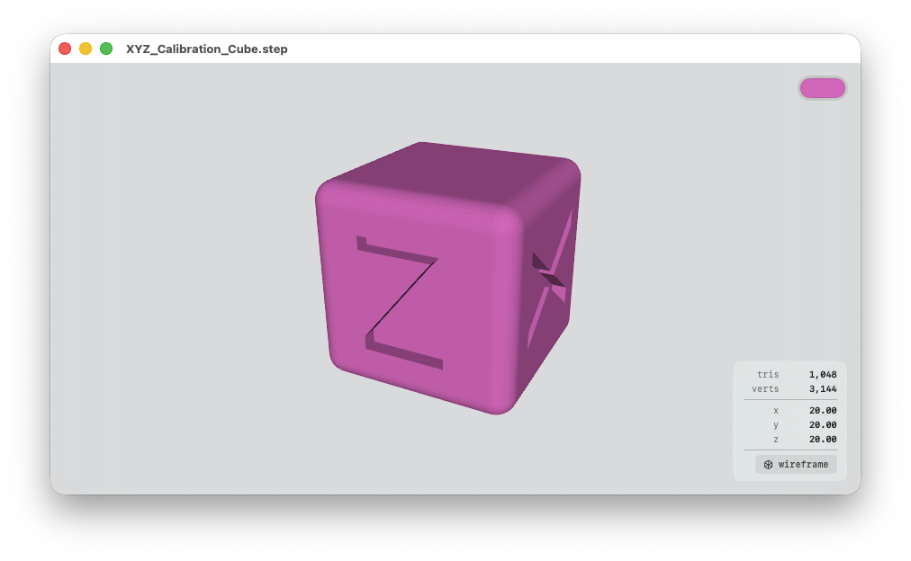

# STEP File Viewer


A basic native macOS app to previews 3D model files, like `.step` files.

Supported formats:

| Format | Notes                                                              |
| ------ | ------------------------------------------------------------------ |
| STL    | Binary + ASCII, parsed directly                                    |
| OBJ    | ModelIO                                                            |
| PLY    | ModelIO                                                            |
| USDZ / USD / USDA / USDC | ModelIO                                          |
| 3MF    | Custom: unzipped via `/usr/bin/unzip`, XML parsed with XMLParser   |
| STEP / STP | Solid mesh via FreeCAD; wireframe fallback — see below         |

## STEP support

STEP stores B-Rep geometry (parametric curves and surfaces) that must be
tessellated into triangles before it can be shaded — which realistically
requires OpenCASCADE.

- **If FreeCAD is installed** (`/Applications/FreeCAD.app`), the app shells
  out to its `freecadcmd` tool to tessellate the STEP file into a solid mesh
  (FreeCAD bundles OpenCASCADE). This is the normal path and renders STEP
  files as proper shaded solids. Tessellation deflection is scaled to the
  model's size.
- **If FreeCAD is not installed**, the app falls back to a wireframe preview:
  a minimal parser extracts `CARTESIAN_POINT`, `VERTEX_POINT`, and
  `EDGE_CURVE` entities and renders them as a point cloud plus straight-edge
  wireframe. Curved edges appear as chords.

Model loading runs off the main thread with a loading spinner, so the slower
FreeCAD path never freezes the UI.

## Build & run

```
make           # builds build/STEP File Viewer.app
make run       # builds and opens the app
make clean
```

Requirements: macOS 13+, Xcode command-line tools (`swiftc`). No Xcode
project — the Makefile drives `swiftc` against the sources in
`Sources/STEPFileViewer/` and assembles a code-signed `.app` bundle.

## Controls

| Action                | Input                                |
| --------------------- | ------------------------------------ |
| Orbit camera          | Click + drag in viewport             |
| Pan                   | Option + click + drag                |
| Zoom                  | Two-finger scroll / pinch            |
| Move window           | Drag the title bar                   |
| Open file             | ⌘O, or drag-and-drop onto window     |
| Close window          | Close button, or ⌘W                  |
| Quit                  | ⌘Q                                   |

The window has a standard macOS title bar (close / minimize / zoom buttons);
the current filename is shown as the window title. Below it, the content area
is a translucent light "Quick Look" background that the desktop blurs
through, filled by the 3D viewport with a small statistics HUD docked
bottom-right.

## Object color

A color well in the top-right of the viewport recolors every geometry
material (the `diffuse` channel). The chosen color is persisted to
`UserDefaults` as `objectColor.rgba` (four sRGB components) and restored on
the next launch.

## Statistics HUD

Bottom-right overlay shows:

- `tris`, `quads`, `ngons` — face counts by topology (quads are only
  preserved when the source file declared them, e.g. OBJ; SceneKit
  triangulates everything on import, so we tally counts at MDLAsset level)
- `lines`, `points` — non-mesh primitives (used by STEP wireframe preview)
- `verts` — vertex count
- `meshes` — submesh count when > 1
- `x`, `y`, `z` — bounding box dimensions in source units

It also has a **wireframe** toggle button at the bottom of the HUD, which
switches the viewport between solid shading and wireframe rendering
(`SCNView.debugOptions = .renderAsWireframe`).

## Project layout

```
Sources/STEPFileViewer/
  App.swift              # @main, AppDelegate, NSWindow configuration
  ContentView.swift      # Root SwiftUI view — viewport + HUD + drop target
  SceneViewport.swift    # SCNView wrapper — orbit camera, color, wireframe
  ModelStore.swift       # Observable model state + file picker
  ModelLoader.swift      # Format dispatch + SCNGeometry builders
  ModelStatistics.swift  # Face / vertex / bounds accounting
  StatisticsHUD.swift    # Bottom-right statistics overlay + wireframe toggle
  STLLoader.swift        # Binary + ASCII STL
  ThreeMFLoader.swift    # 3MF (ZIP + XML)
  STEPLoader.swift       # STEP: FreeCAD solid mesh, wireframe fallback
  FreeCADBridge.swift    # Shells out to FreeCAD to tessellate STEP
Tests/
  test_loaders.swift     # Standalone CLI test runner for loaders
  fixtures/              # Committed sample model files for the tests
Resources/
  Info.plist             # Bundle metadata + document type associations
.github/workflows/
  ci.yml                 # Build + test + artifact upload on macOS
Makefile                 # swiftc → .app bundle + codesign; `make test`
```

## Running the loader tests

```
make test
```

This compiles the non-UI loader sources together with `Tests/test_loaders.swift`
into a small CLI runner and executes it against the committed sample files in
`Tests/fixtures/` (`cube.stl`, `cube_ascii.stl`, `tri.obj`, `quad.3mf`,
`tiny.step`, `block.step`). The "STEP solid via FreeCAD" test self-skips when
FreeCAD is not installed.

## Continuous integration

`.github/workflows/ci.yml` runs on every push to `main`, on pull requests,
and on manual dispatch. On a `macos-latest` runner it:

1. builds the app with `make`,
2. runs the loader tests with `make test` (the STEP-solid test skips, since
   FreeCAD is not on the runner),
3. uploads the built `STEP File Viewer.app` as a workflow artifact.
